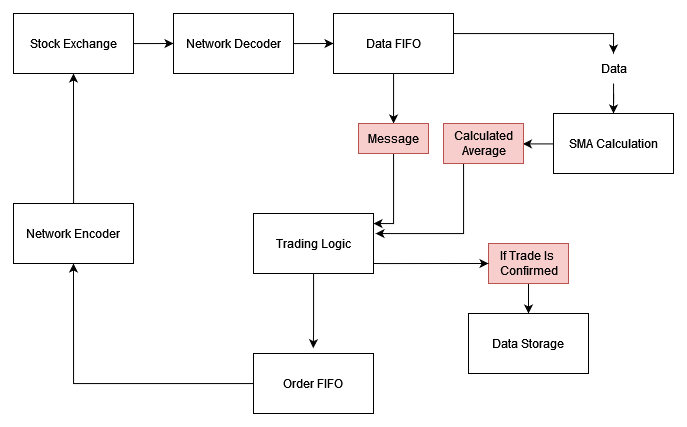
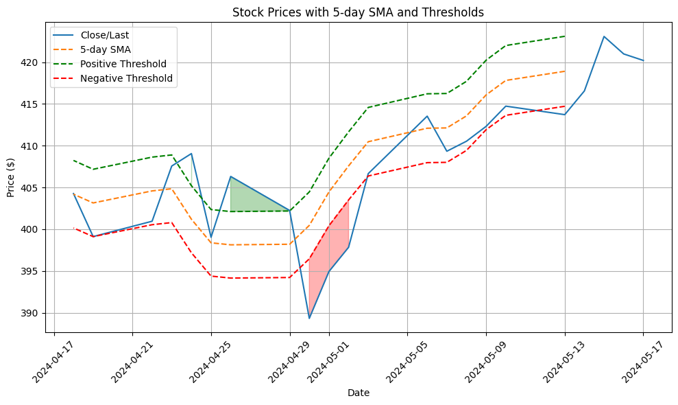
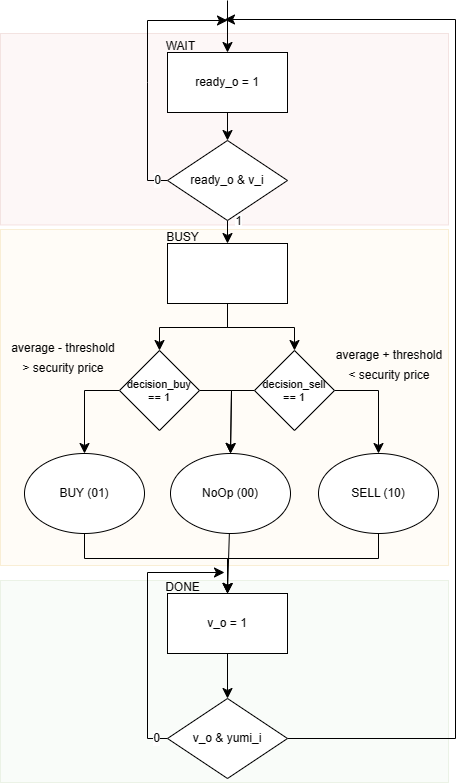

# EE478 Capstone

## Description
A theorized algorithm for high-frequency trading of Microsoft shares. Modeled after currently used trading devices. This device will trade only one type of security, which will then be implemented in multiple different cores to trade multiple securities.

## Simplified FIX/FAST Encoding
_**All prices are specified in price for a single security**_
| MsgType   | Symbol  | BidPx  | BidSize | OfferPx | OfferSize |
| --------- | ------- | ------ | ------- | ------- | --------- |
| 2'b       | 32'b    | 64'b   | 8'b     | 64'b    | 8'b       |

- We will be utilizing the CUSIP Number for Microsoft (MSFT) which is **594918104** (00100011011101011011101011011000).
- Confirmation means that the trade was accepted and went through, the rest of the message will say the amount and the symbol/price and other information to distinguish it.
- The largest price will be 9223372036854775807 (in cents)

| MsgType       |            |            |
|---------------|---------|------------|
| NoOp          |0          | 0          |
| BUY           |0          | 1          |
| SELL          |1          | 0          |
| Confirmation  |1          | 1          |

- BUY is the signal that is sent to the chip that dictates that a client wants to purchase a security.
- SELL us the signal that is sent to the chip that dictates that a client wants to sell a security.
- BUY and SELL signals will be used to dictate whether we are buying or selling something also. The NoOp is used if we do not wish to act on a exchange that is being offered.
- Confirmation means that the exchange has processed our order and we can increment or decrement the counter that controls the number of securities that is in our inventory. 

| Field    | Bit Range | Description       |
|----------|-----------|-------------------|
| MsgType  | 177:176   | Message Type      |
| Symbol   | 175:144   | Symbol            |
| BidPx    | 143:80    | Bid Price         |
| BidSize  | 79:72     | Bid Size          |
| OfferPx  | 71:8      | Offer Price       |
| OfferSize| 7:0       | Offer Size        |

- **MsgType** is the type of order or communication similar to a op code for a CUSIP
- **Symbol** is the binary CUSIP number that denotes what security is being traded
- **BidPx** is the price that is used in purchasing operations (by the chip)
- **BidSize** is the size of the order (how many securities to purchase) that is used by the chip
- **OfferPx** is the price that is used as a quote for securities
- **OfferSize** is the size of the order that is tied to the quote of the batch of the securities

### Confirmation
Confirmation operations are a little different those of the other operations. It uses the offer bits of the signal to express a confirmation for a purchase (increment counter). The bid bits of the signal are used to express a confirmation for a sale (decrement counter). Both fields can be filled at once, but if it is all zeros then nothing will occur.

##SMA
The simple moving average (SMA) algorithm module takes in data from the incoming encoding message and performs an average calculation based on window size. It can be configured as a passthrough module with a window size of 1. By default the window size is 4. Future work will incorporate an enable signal into the SMA to grant the ability to perform operations with finer control, and a storage module to enable the SMA to work over multiple CUSIP numbers.

## Trading Module
The trading module will take in data from the algorithm module, it will then compare it to the average and make a decision whether or not to purchase the security. The image below shows an example of how this system works. The green and red highlighted areas indicate a buy or sell decision is executed here.

The trade decision module works with a simple handshake to determine if the data that it is intaking is valid. This is paired with the bsg_guts to provide communication and simulation of a fifo of bits from the network protocol.

### BSG Link
To operationalize the use of the chip we will be utilizing BSG_Link and bsg_guts (bsg_wormhole_router) provided by the [Bespoke Silicon Group](https://www.bsg.ai/) at the University of Washington under Professor Tayor. This system will be used primarily for the interface to the trading system. This chip utilized 8-bits of physical wires per DDR channel utilizing a standard sized FSB packet (80-bits) to communicate with the trade_decision module. The FSB packet is defined in the following table:

| 4-bits    | 1-bit | 75-bits       |
|----------|-----------|-------------------|
| destID  | s=0   | data      |

The destID is what routes the packet. This is fed by bsg_trace_master_0.tr which is generated by out python testbench. The trace file will send 3 packets before the trade_decision module will calculate, this is as the input to the system is 178 bits.

### Serial Input Parallel Output
To  facilitate the 3 data packets to be usable by the trade decision module we will be utilizing [bsg_serial_in_parallel_out_full](https://github.com/bespoke-silicon-group/basejump_stl/blob/master/bsg_dataflow/bsg_serial_in_parallel_out_full.sv). This module utilizes a handshake process to output the data only when the entire output array is fully assembled. When this occurs we will be only utilizing the necessary bits and the rest will be grounded (this is generated in the python file also).

### Parallel Input Serial Output
Similarly on the output it needs to be be serialized so that it can go back through the interface. This will use the module [bsg_parallel_in_serial_out](https://github.com/bespoke-silicon-group/basejump_stl/blob/master/bsg_dataflow/bsg_parallel_in_serial_out.sv). It also utilizes a similar handshake to the parallel output.

